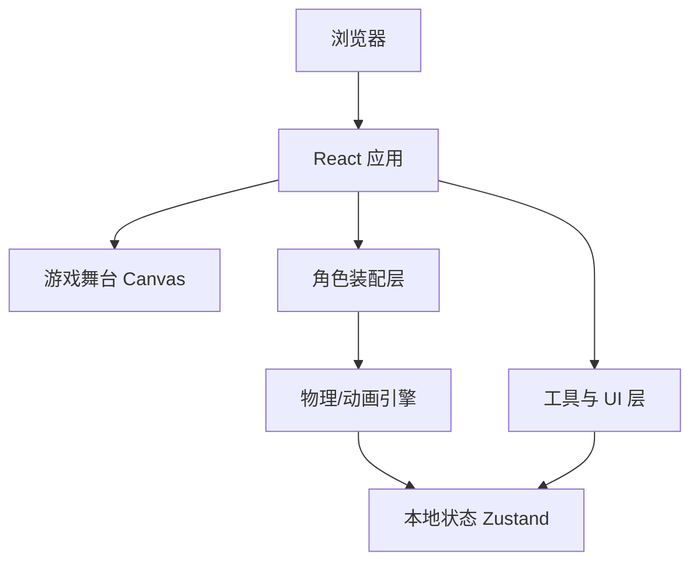

## 1. 架构设计



## 2. 技术描述

- **前端**：React@18 + TypeScript + Vite + Tailwind CSS
- **初始化工具**：vite-init（模板 `react-ts`）
- **状态管理**：Zustand
- **动画**：GSAP（弹性、冲击、震动）
- **物理/拖拽**：原生 Pointer Events + 弹簧插值，无需重型物理引擎
- **图标**：lucide-react
- **后端**：无，数据使用 localStorage 存储最高分

## 3. 路由定义

| 路由 | 用途 |
|------|------|
| `/` | 游戏主页面（单页应用） |

## 4. API 定义

无后端，不定义 API。

## 5. 数据模型

### 5.1 本地存储 Schema

```typescript
interface GameRecord {
  highScore: number;
  lastUpdated: string;
}
```

### 5.2 应用状态

```typescript
interface GameState {
  score: number;
  combo: number;
  maxCombo: number;
  highScore: number;
  selectedTool: ToolId;
  characterState: CharacterState;
  parts: CharacterPart[];
  hits: HitRecord[];
  increaseScore: (delta: number) => void;
  breakCombo: () => void;
  setTool: (tool: ToolId) => void;
  setCharacterState: (state: CharacterState) => void;
  resetCharacter: () => void;
}

interface CharacterPart {
  id: string;
  src: string;
  x: number;
  y: number;
  rotation: number;
  scale: number;
  zIndex: number;
  pivotX: number;
  pivotY: number;
  naturalWidth: number;
  naturalHeight: number;
}

interface HitRecord {
  id: string;
  damage: number;
  x: number;
  y: number;
  timestamp: number;
}

type ToolId = 'fist' | 'slipper' | 'bat' | 'lightning' | 'ice' | 'slingshot' | 'hand';
type CharacterState = 'normal' | 'hurt' | 'dizzy' | 'frozen' | 'burnt' | 'openMouth' | 'closedEyes';
```

## 6. 零件层级说明

| 零件 | 文件名 | zIndex | 关节/父级 |
|------|--------|--------|----------|
| 后蝴蝶结 | 后蝴蝶结.png | 1 | 身体 |
| 尾巴 | 尾巴.png | 2 | 身体 |
| 身体 | 身体.png | 10 | 根节点 |
| 左手 | 左手.png | 11 | 身体 |
| 右手 | 右手.png | 11 | 身体 |
| 脸 | 脸.png | 20 | 身体 |
| 左耳 | 左耳.png | 19 | 脸 |
| 右耳 | 右耳.png | 19 | 脸 |
| 眼睛 | 眼睛.png | 21 | 脸 |
| 闭眼 | 闭眼.png | 21 | 脸（可切换） |
| 嘴 | 嘴.png | 22 | 脸 |
| 张嘴 | 张嘴.png | 22 | 脸（可切换） |
| 前蝴蝶结 | 前蝴蝶结.png | 23 | 身体 |
| 挂饰 | 挂饰.png | 24 | 身体 |

## 7. 关键实现策略

- **角色装配**：所有零件使用绝对定位 `img`，通过 GSAP 实时更新 `transform` 与 `filter`
- **拖拽**：每个零件监听 `pointerdown/move/up`，记录偏移量与速度，释放时根据速度施加惯性
- **冲击反应**：受击零件朝受力方向旋转并回弹，父级零件联动产生连锁反应
- **表情切换**：受击后随机替换「眼睛/嘴」为「闭眼/张嘴」持续 200-400ms，再恢复
- **状态特效**：冰冻使用 `filter: hue-rotate(180deg) brightness(1.2) drop-shadow(...)`；烧焦使用深棕色调 + 蒸汽动画
- **连击系统**：每次命中在 1.2s 内再次命中则连击 +1，否则重置
- **性能**：使用 `requestAnimationFrame` 更新动画，避免 React 状态频繁触发重渲染
