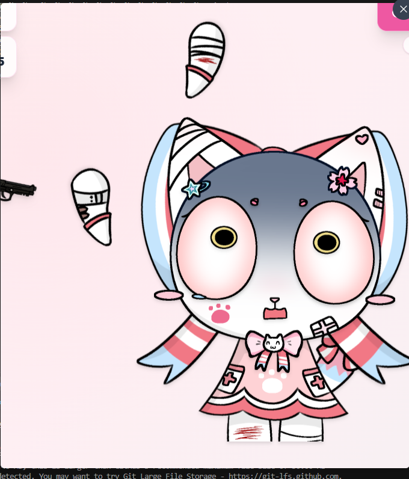

1.[%E5%98%B2%E8%AE%BD%E7%AC%91-%E5%8F%82%E8%80%83.jpg](file;file:///c%3A/Users/11/Documents/877/%E5%98%B2%E8%AE%BD%E7%AC%91-%E5%8F%82%E8%80%83.jpg) [%E5%A4%B1%E6%9C%9B-%E9%A2%84%E8%AE%BE%E5%8F%82%E8%80%83.jpg](file;file:///c%3A/Users/11/Documents/877/%E5%A4%B1%E6%9C%9B-%E9%A2%84%E8%AE%BE%E5%8F%82%E8%80%83.jpg) [%E6%B5%81%E5%8F%A3%E6%B0%B4%E8%A1%A8%E6%83%85-%E5%8F%82%E8%80%83.jpg](file;file:///c%3A/Users/11/Documents/877/%E6%B5%81%E5%8F%A3%E6%B0%B4%E8%A1%A8%E6%83%85-%E5%8F%82%E8%80%83.jpg) [%E7%A8%8D%E5%BE%AE%E5%AE%B3%E6%80%95-%E5%8F%82%E8%80%83.jpg](file;file:///c%3A/Users/11/Documents/877/%E7%A8%8D%E5%BE%AE%E5%AE%B3%E6%80%95-%E5%8F%82%E8%80%83.jpg) 请参考，你自己打开浏览器看看，到1000分攻击后重复播放声音，应该有间隔和只能播放一个声音，还有表情冲突，淤青等伤口直接贴在屏幕上，都不缩小一下的，不应该采用画笔式吗，你应该给每个部件上一个隐藏的box框
2.这是抱头？抱头动作错误
3.伤口贴在脸上，或者对其他地方，
